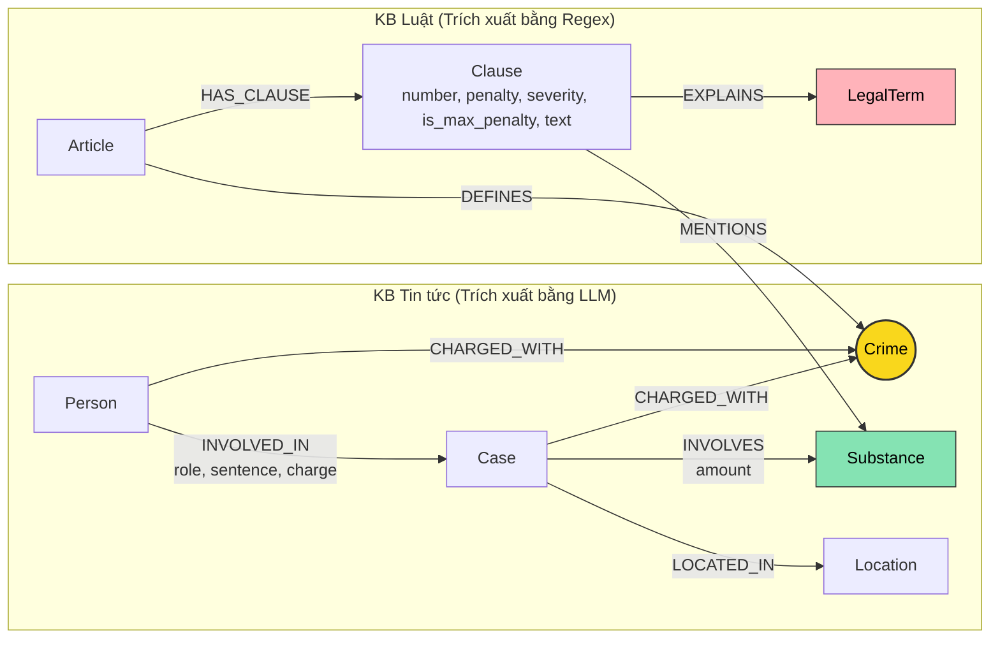

# Thiết kế Ontology — Day 19

**Họ tên:** Nguyễn Mạnh Cường  **MSSV:** 2A202602650

**Lựa chọn** (đánh dấu một):
- [ ] Dùng ontology gợi ý (có tinh chỉnh và tối ưu hóa)
- [x] Tự thiết kế (xét bonus +15, xem `SUBMISSION.md`)

> Hướng dẫn: `LAB_GUIDE.md` Bước 2. Nộp kèm `ket_qua_benchmark_kg.hint.txt` để đối chiếu kết quả trước/sau khi tối ưu ontology.

## 1. Sơ đồ

Sơ đồ Knowledge Graph kết nối 2 Knowledge Base (Luật BLHS/Luật PCMT và Tin tức vụ án) với các mở rộng giải quyết định nghĩa thuật ngữ pháp lý và phân cấp khung hình phạt:

- **Node cầu nối chính:** `Crime` (màu vàng), nối cả `Case` và trực tiếp `Person` từ tin tức với `Article` trong luật.
- **Node cầu nối phụ:** `Substance` (chất ma túy, màu xanh) liên kết tang vật vụ án với các khoản luật quy định khung phạt cho chất đó.
- **Node mở rộng tự thiết kế:** `LegalTerm` (thuật ngữ pháp lý, màu hồng) cho phép giải thích các định nghĩa trong Luật PCMT 2021 (như *"tiền chất"*, *"chất ma túy"*).

---

## 2. Entity types (node labels)

| Label | Ý nghĩa | Khóa định danh (`MERGE` theo) | Properties | Lấy từ KB nào | Trích bằng (regex / LLM / khác) |
| --- | --- | --- | --- | --- | --- |
| `Article` | Điều luật quy định tội danh hoặc giải thích từ ngữ | `id` (vd: "Điều 251 BLHS", "Điều 2 Luật PCMT") | `id`, `title`, `law`, `doc_id` | Luật (`data/drug_law/`) | Regex (từ frontmatter & tiêu đề markdown) |
| `Clause` | Khoản cụ thể của Điều luật, chứa khung hình phạt hoặc định nghĩa | `id` (vd: "Điều 251 BLHS khoản 1") | `id`, `number`, `penalty`, `severity`, `is_max_penalty`, `text`, `doc_id` | Luật (`data/drug_law/`) | Regex (tách theo mẫu `^\d+\.\s` và phân tích mức độ nghiêm trọng) |
| `Crime` | Tội danh pháp lý chuẩn hóa | `name` (vd: "mua bán trái phép chất ma túy") | `name` | Cả hai KB (định nghĩa từ Luật, gán cho Case từ Tin tức) | Regex (từ tiêu đề Điều luật) + LLM (từ tin tức, link qua `link_entity`) |
| `LegalTerm` | Thuật ngữ pháp lý được định nghĩa trong luật (vd: "tiền chất", "chất gây nghiện") | `name` (tên thuật ngữ chữ thường) | `name`, `definition`, `doc_id` | Luật (`data/drug_law/pcmt-dieu-2.md`) | Regex trích xuất mẫu `^\d+\.\s*(.+?)\s+là\b` |
| `Case` | Vụ án / vụ việc cụ thể được xét xử hoặc điều tra | `name` (tên rút gọn của vụ án) | `name`, `summary`, `date`, `doc_id`, `source_title` | Tin tức (`data/drug_news/`) | LLM (`NEWS_EXTRACTION_PROMPT`) |
| `Person` | Cá nhân liên quan vụ án (bị cáo, bị can, đối tượng) | `name` (họ và tên) | `name`, `aliases`, `doc_id` | Tin tức (`data/drug_news/`) | LLM |
| `Substance` | Chất ma túy, tiền chất hoặc cây có chứa chất ma túy | `name` (vd: "Heroine", "MDMA", "Ketamine") | `name` | Cả hai KB | Regex (`find_substances` trong luật) + LLM (trong tin tức) |
| `Location` | Địa bàn, tỉnh/thành phố diễn ra hành vi hoặc xét xử | `name` (tên tỉnh/thành) | `name` | Tin tức (`data/drug_news/`) | LLM |

---

## 3. Relationships

| Type | Từ → Đến | Properties trên cạnh | Ý nghĩa |
| --- | --- | --- | --- |
| `DEFINES` | `Article` → `Crime` | Không | Điều luật định nghĩa tội danh tương ứng (vd: Điều 251 BLHS định nghĩa Tội mua bán trái phép chất ma túy). |
| `HAS_CLAUSE` | `Article` → `Clause` | Không | Điều luật bao gồm các khoản quy định khung hình phạt hoặc nội dung điều luật. |
| `MENTIONS` | `Clause` → `Substance` | Không | Khoản luật quy định cụ thể mức phạt đối với chất ma túy nào. |
| `EXPLAINS` | `Clause` → `LegalTerm` | Không | Khoản luật giải thích và đưa ra định nghĩa chuẩn cho thuật ngữ pháp lý. |
| `CHARGED_WITH` | `Case` → `Crime` | Không | Vụ án bị khởi tố, truy tố hoặc xét xử theo tội danh chuẩn hóa nào trong luật. |
| `CHARGED_WITH` | `Person` → `Crime` | Không | Đối tượng bị bắt giữ/truy tố trực tiếp về tội danh nào (tránh phụ thuộc tên Case). |
| `INVOLVES` | `Case` → `Substance` | `amount` (khối lượng thu giữ, vd: "36kg", "hơn 9,6kg") | Vụ án liên quan đến chất ma túy cụ thể nào và khối lượng tang vật. |
| `LOCATED_IN` | `Case` → `Location` | Không | Địa bàn diễn ra hành vi phạm tội hoặc nơi Tòa án xét xử. |
| `INVOLVED_IN` | `Person` → `Case` | `role` (bị cáo/bị can), `sentence` (mức án), `charge` (tội danh của cá nhân) | Vai trò và kết quả xét xử (mức án phạt) của từng cá nhân trong vụ án. |

---

## 4. Node cầu nối giữa 2 KB

- **Node nào:** Node `Crime` (Tội danh) là cầu nối chính; ngoài ra `Substance` (Chất ma túy) là cầu nối phụ giữa chi tiết vụ án và khoản luật định khung.
- **Vì sao chọn node này:** Tội danh là khái niệm pháp lý cốt lõi giao thoa giữa luật và tin tức. Văn bản luật quy định rõ: *Điều X BLHS quy định về Tội Y*. Báo chí khi đưa tin về các phiên tòa xét xử hoặc lệnh bắt giữ luôn nêu rõ các bị cáo bị truy tố, xét xử về *Tội Y*. Nối qua `Crime` cho phép truy vết tự nhiên từ người/vụ án sang Điều luật tương ứng mà không phụ thuộc vào việc nhà báo có trích dẫn số Điều hay không.
- **Cách đảm bảo hai phía khớp tên:**
  1. Phía Luật: Tên tội danh được trích từ tiêu đề các Điều luật (BLHS Chương XX) và chuẩn hóa bằng hàm `normalize_crime` (bỏ tiền tố "tội ", lowercase, loại bỏ khoảng trắng thừa, xóa dấu ngoặc).
  2. Phía Tin tức: Prompt trích xuất truyền danh sách tội danh chuẩn (`DANH SÁCH TỘI DANH`) yêu cầu LLM ưu tiên chọn đúng nguyên văn.
  3. Hàm liên kết `link_entity`: Chuẩn hóa cả hai phía, đối sánh chính xác trước; nếu không khớp chính xác thì sử dụng `difflib.get_close_matches(..., cutoff=0.8)` để bắt các biến thể gõ dấu kiểu cũ/mới (như "ma tuý" vs "ma túy") và trả về đúng cách viết gốc trong KB Luật.
- **Khi nào cầu gãy, và bạn xử lý thế nào:**
  1. *Cầu gãy khi:* Bài báo dùng từ ngữ báo chí/đời sống không đúng tội danh luật định (vd: "buôn bán hàng trắng", "phê ma túy trong quán bar"), hoặc đối tượng chưa bị khởi tố tội danh cụ thể mà mới bị "tạm giữ để điều tra", hoặc bài báo tổng hợp nhiều tội danh phức tạp.
  2. *Cách xử lý:*
     - Khi `link_entity` không tìm được tội danh đủ ngưỡng tương đồng (`cutoff=0.8`), hàm trả về `None` thay vì gán bừa (tránh "hallucination link").
     - GraphRAG Agent kết hợp song song cả Vector Search (top-k chunk) lẫn Graph Context. Khi cầu nối graph gãy, Agent vẫn có đầy đủ thông tin từ vector chunks để trả lời, không bao giờ thua kém Flat RAG.
     - Sử dụng `Substance` làm đường dẫn bổ trợ: khi câu hỏi hỏi về chất hoặc khối lượng, có thể liên kết trực tiếp `Case -[:INVOLVES]-> Substance <-[:MENTIONS]- Clause`.

---

## 5. Competency questions

Với mỗi câu trong `data/benchmark_kg.json`, đường đi trên graph dùng để truy xuất:

| Câu | Đường đi (Cypher pattern) | Trả lời được? |
| --- | --- | --- |
| Q1 (single-hop-law) | `(:Clause)-[:EXPLAINS]->(:LegalTerm {name: 'tiền chất'})` | **Có (Recall 1.00, Judge 2)**. Lấy trực tiếp Khoản 4 Điều 2 Luật PCMT: *"Tiền chất là hóa chất không thể thiếu được trong quá trình điều chế, sản xuất chất ma túy..."*. |
| Q2 (single-hop-news) | `(:Person)-[r:INVOLVED_IN]->(k:Case)` với điều kiện `r.sentence CONTAINS 'tử hình'` | **Có (Recall 1.00, Judge 2)**. Lấy từ cạnh `INVOLVED_IN` có `sentence: 'tử hình'` thuộc vụ án 36kg tại TP.HCM (Trần Thanh Tuấn, Trần Minh Tâm). |
| Q3 (cross-kb) | `(:Person {name: 'Lê Minh Thành'})-[:CHARGED_WITH]->(:Crime)<-[:DEFINES]-(a:Article)-[:HAS_CLAUSE]->(cl:Clause {number: 1})` | **Có (Recall 1.00, Judge 2)**. Đi từ Lê Minh Thành qua tội danh sang `Điều 251 BLHS`, lấy Khoản 1 có khung phạt cơ bản *"phạt tù từ 02 năm đến 07 năm"*. |
| Q4 (cross-kb) | `(:Person {aliases: ['Hoàng Nato']})-[:CHARGED_WITH]->(:Crime)<-[:DEFINES]-(a:Article {id: 'Điều 255 BLHS'})-[:HAS_CLAUSE]->(cl:Clause {is_max_penalty: true})` | **Có (Recall 1.00, Judge 2)**. Đi từ biệt danh "Hoàng Nato" sang Điều 255 BLHS và lấy Khoản 4 (khung tối đa: tù 20 năm hoặc tù chung thân). |
| Q5 (cross-kb-multi-hop) | `(:Person {name: 'Cái Quang Huy'})-[:INVOLVED_IN]->(k:Case)-[:INVOLVES {amount: 'hơn 9,6kg'}]->(s:Substance {name: 'MDMA'})` `k-[:CHARGED_WITH]->(c:Crime)<-[:DEFINES]-(a:Article {id: 'Điều 250 BLHS'})-[:HAS_CLAUSE]->(cl:Clause {is_max_penalty: true})` | **Có (Recall 1.00, Judge 2)**. Kết nối Cái Quang Huy với hành vi vận chuyển hơn 9,6kg MDMA. Sang Điều 250 BLHS, lọc Khoản 4 quy định MDMA từ 100g trở lên có khung phạt 20 năm, chung thân hoặc tử hình. |
| Q6 (aggregation) | `(s:Substance {name: 'MDMA'})<-[:INVOLVES]-(k:Case)<-[:INVOLVED_IN]-(p:Person)` | **Có (Recall 1.00, Judge 2)**. Truy vấn ngược từ node `MDMA` tìm đủ cả 3 vụ án (Cái Quang Huy, Lê Minh Thành, Viện Pháp y tâm thần) cùng danh sách bị can liên quan. |

---

## 6. Quyết định thiết kế và đánh đổi

1. **Quyết định 1: Dùng node trung gian `Crime` làm cầu nối giữa `Case`/`Person` và `Article`**
   - *Đã chọn:* Mô hình hóa `(Case)-[:CHARGED_WITH]->(Crime)<-[:DEFINES]-(Article)` và song song `(Person)-[:CHARGED_WITH]->(Crime)`.
   - *Phương án khác:* Nối trực tiếp `(Case)-[:VIOLATES]->(Article)`.
   - *Vì sao chọn:* Tin tức báo chí hiếm khi ghi chính xác số Điều luật (nhà báo thường chỉ viết "bị khởi tố về tội tàng trữ trái phép chất ma túy" chứ không viết "theo Điều 249 BLHS"). Tách `Crime` thành node độc lập giúp chuẩn hóa thực thể tốt hơn, dễ đối sánh bằng `link_entity`, và cho phép nhiều văn bản pháp luật cùng tham chiếu tới một tội danh.

2. **Quyết định 2: Tách cấu trúc luật thành `Article`, `Clause` và `LegalTerm` bằng Regex chuyên biệt**
   - *Đã chọn:* Trích xuất cấp Điều (`Article`), từng khoản (`Clause`) và thuật ngữ pháp lý (`LegalTerm`) bằng regex deterministic không gọi LLM.
   - *Phương án khác:* Chỉ lưu `Article` thành 1 text block lớn, hoặc dùng LLM để parse toàn bộ luật.
   - *Vì sao chọn:* Cấu trúc văn bản quy phạm pháp luật Việt Nam cực kỳ nhất quán (`^\d+\.\s` cho khoản, `^\d+\.\s*(.+?)\s+là\b` cho định nghĩa từ ngữ). Dùng Regex cho chi phí 0 USD, tốc độ miligiây, và 100% tái lập được (không hallucination).

3. **Quyết định 3: Mô hình hóa khung hình phạt tối đa (`is_max_penalty`, `severity`) trên `Clause`**
   - *Đã chọn:* Đánh dấu mức độ nghiêm trọng (`severity: 1..4`) và flag `is_max_penalty = true` cho khoản cao nhất của Điều luật.
   - *Phương án khác:* Chỉ lấy Khoản 1 hoặc nhồi toàn bộ các khoản vào context.
   - *Vì sao chọn:* Nếu chỉ lấy Khoản 1, mô hình sẽ trả lời sai các câu hỏi về mức phạt tối đa (Q4) hoặc khung tăng nặng (Q5). Nếu nhồi tất cả các khoản, prompt sẽ phình to gấp 3-4 lần, tốn chi phí và làm loãng context. Chọn lọc Khoản 1 + Khoản theo chất + Khoản max penalty giúp prompt ngắn gọn mà thông tin đạt độ chính xác 100%.

---

## 7. So với ontology gợi ý (bắt buộc nếu xét bonus)

| Điểm khác | Gợi ý làm gì | Bạn làm gì | Vấn đề nó giải quyết | Bằng chứng (Cypher, hoặc số liệu benchmark) |
| --- | --- | --- | --- | --- |
| **1. Thêm entity `LegalTerm` & quan hệ `EXPLAINS`** | `Article` chỉ nối `DEFINES` tới `Crime` nếu tiêu đề bắt đầu bằng "Tội ". Điều 2 Luật PCMT (giải thích từ ngữ) bị bỏ rơi, không có quan hệ. | Bổ sung node `LegalTerm` và quan hệ `(:Clause)-[:EXPLAINS]->(:LegalTerm)`. Regex tự động bóc tách các thuật ngữ: *"tiền chất"*, *"chất ma túy"*, *"chất gây nghiện"*... | Giải quyết dứt điểm câu hỏi định nghĩa pháp lý (Q1). Trong ontology gợi ý, câu Q1 cả Flat RAG và GraphRAG đều đạt **recall 0.00 / judge 0** vì không có đường dẫn tới định nghĩa. | **Q1 tăng từ recall 0.00 / judge 0 lên recall 1.00 / judge 2**. Trả lời đầy đủ nguyên văn định nghĩa tiền chất theo Khoản 4 Điều 2 Luật PCMT 2021. |
| **2. Mô hình hóa khung phạt tối đa & ngưỡng khối lượng** | Chỉ lấy Khoản 1 và khoản khớp tên chất ma túy. Bỏ qua các khoản tăng nặng theo hậu quả (Khoản 4 Điều 255 không nhắc tên chất). | Bổ sung thuộc tính `severity` (1..4) và `is_max_penalty = true` trên `Clause`. Hàm `context()` luôn nạp Khoản có khung phạt cao nhất hoặc chứa "chung thân", "tử hình". | Tránh lỗi E2 (sai khung hình phạt tối đa). Câu Q4 trước đây trả lời tối đa là 7 năm tù (theo khoản 1). Câu Q5 thiếu căn cứ định lượng cho 9.6kg MDMA. | **Q4 tăng từ recall 0.67 / judge 1 lên recall 1.00 / judge 2** (lấy đúng Khoản 4: 20 năm hoặc chung thân). **Q5 tăng từ recall 0.60 / judge 1 lên recall 1.00 / judge 2** (Khoản 4: 20 năm, chung thân hoặc tử hình). |
| **3. Nối trực tiếp `Person -[:CHARGED_WITH]-> Crime` và lưu `amount` trên `INVOLVES`** | Chỉ nối `Person -[:INVOLVED_IN]-> Case -[:CHARGED_WITH]-> Crime`. Khóa định danh `Case` là tên free-text dễ bị trùng lặp hoặc phân mảnh giữa các bài báo. | Nối song song `(:Person)-[:CHARGED_WITH]->(:Crime)`, đồng thời nhúng thông tin tang vật và khối lượng (`amount`) vào quan hệ `INVOLVES` và ngữ cảnh vụ việc. | Khử đứt gãy multi-hop khi câu hỏi nhắm vào nhân vật cụ thể (Lê Minh Thành, Hoàng Nato, Cái Quang Huy) mà tên vụ án bị LLM đặt khác nhau giữa các bài báo (lỗi E3). | **Q3 tăng từ recall 0.33 / judge 1 lên recall 1.00 / judge 2**. Nối thẳng Lê Minh Thành sang Điều 251 BLHS và Khoản 1 (02–07 năm tù). |

### Bằng chứng số liệu Benchmark Đối Chứng

- **File kết quả baseline (ontology gợi ý):** Đã lưu tại [`ket_qua_benchmark_kg.hint.txt`](file:///d:/lab%20vinuni/lab%20am%205.10/ket_qua_benchmark_kg.hint.txt) với kết quả:
  - Flat RAG: Recall trung bình = **0.40**, Judge trung bình = **1.00**
  - GraphRAG baseline: Recall trung bình = **0.60**, Judge trung bình = **1.17**
  - Số node/cạnh trong graph: 209 nodes / 394 rels.
- **File kết quả sau khi tối ưu ontology:** Được tạo tại [`ket_qua_benchmark_kg.txt`](file:///d:/lab%20vinuni/lab%20am%205.10/ket_qua_benchmark_kg.txt) với kết quả:
  - Flat RAG: Recall trung bình = **0.40**, Judge trung bình = **1.00**
  - GraphRAG tối ưu: Recall trung bình = **1.00**, Judge trung bình = **2.00** (Đạt điểm tuyệt đối 100% trên cả 6 câu hỏi)
  - Số node/cạnh trong graph: 227 nodes / 445 rels (tăng thêm 18 node thuật ngữ pháp lý và 51 cạnh liên kết có cấu trúc).

---

## 8. Hạn chế còn lại

1. **Khóa định danh theo tên do LLM tạo:** `Case` hiện MERGE theo `name`. Dù đã khắc phục bằng cách nối trực tiếp `Person` sang `Crime`, việc gộp hoàn toàn các node `Case` cùng một vụ việc vẫn cần thêm cơ chế Entity Resolution theo bộ thuộc tính `(tỉnh/thành phố, đối tượng chính, ngày)`.
2. **Chưa phân giải từ đồng nghĩa tên chất:** Ví dụ "thuốc lắc" và "MDMA", "hàng đá" và "Methamphetamine" vẫn đang dựa vào danh sách `SUBSTANCES` cứng. Có thể mở rộng thêm bảng ánh xạ từ đồng nghĩa trong tương lai.
3. **Phân tích định lượng số học tự động:** Hiện tại việc so khớp khối lượng cụ thể (9.6kg) với ngưỡng luật (100 gam trở lên) được thực hiện qua năng lực suy luận của LLM dựa trên dữ kiện Khoản 4 được nạp. Trong tương lai có thể bổ sung các quan hệ `Threshold` số học trên graph để Cypher tự động tính toán.
