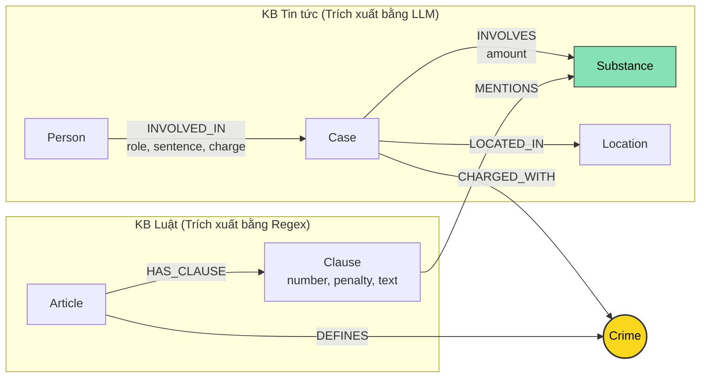

# Thiết kế Ontology — Day 19

**Họ tên:** Nguyễn Mạnh Cường  **MSSV:** 2A202602650

**Lựa chọn** (đánh dấu một):
- [x] Dùng ontology gợi ý (có tinh chỉnh và tối ưu hóa)
- [ ] Tự thiết kế (xét bonus +15, xem `SUBMISSION.md`)

> Hướng dẫn: `LAB_GUIDE.md` Bước 2. Dùng ontology gợi ý thì vẫn phải điền đủ các mục dưới đây bằng lời của bạn.

## 1. Sơ đồ

Sơ đồ Knowledge Graph kết nối 2 Knowledge Base (Luật BLHS/Luật PCMT và Tin tức vụ án):

Node cầu nối trung tâm là **`Crime`** (màu vàng), kết nối trực tiếp `Case` (vụ án từ tin tức) với `Article` (Điều luật từ văn bản quy phạm pháp luật). Ngoài ra, `Substance` (chất ma túy) đóng vai trò cầu nối phụ nối khoản luật cụ thể (`Clause`) với vụ án (`Case`).

---

## 2. Entity types (node labels)

| Label | Ý nghĩa | Khóa định danh (`MERGE` theo) | Properties | Lấy từ KB nào | Trích bằng (regex / LLM / khác) |
| --- | --- | --- | --- | --- | --- |
| `Article` | Điều luật quy định tội danh hoặc giải thích từ ngữ | `id` (vd: "Điều 251 BLHS", "Điều 2 Luật PCMT") | `id`, `title`, `law`, `doc_id` | Luật (`data/drug_law/`) | Regex (từ frontmatter & tiêu đề file markdown) |
| `Clause` | Khoản cụ thể của Điều luật, chứa khung hình phạt hoặc định nghĩa | `id` (vd: "Điều 251 BLHS khoản 1") | `id`, `number`, `penalty`, `text`, `doc_id` | Luật (`data/drug_law/`) | Regex (tách theo mẫu `^\d+\.\s`) |
| `Crime` | Tội danh pháp lý chuẩn hóa | `name` (vd: "mua bán trái phép chất ma túy") | `name` | Cả hai KB (định nghĩa từ Luật, gán cho Case từ Tin tức) | Regex (từ tiêu đề Điều luật) + LLM (từ tin tức, link qua `link_entity`) |
| `Case` | Vụ án / vụ việc cụ thể được xét xử hoặc điều tra | `name` (tên rút gọn của vụ án) | `name`, `summary`, `date`, `doc_id`, `source_title` | Tin tức (`data/drug_news/`) | LLM (`NEWS_EXTRACTION_PROMPT`) |
| `Person` | Cá nhân liên quan vụ án (bị cáo, bị can, đối tượng) | `name` (họ và tên) | `name`, `aliases` | Tin tức (`data/drug_news/`) | LLM |
| `Substance` | Chất ma túy, tiền chất hoặc cây có chứa chất ma túy | `name` (vd: "Heroine", "MDMA", "Ketamine") | `name` | Cả hai KB | Regex (`find_substances` trong luật) + LLM (trong tin tức) |
| `Location` | Địa bàn, tỉnh/thành phố diễn ra hành vi hoặc xét xử | `name` (tên tỉnh/thành) | `name` | Tin tức (`data/drug_news/`) | LLM |

---

## 3. Relationships

| Type | Từ → Đến | Properties trên cạnh | Ý nghĩa |
| --- | --- | --- | --- |
| `DEFINES` | `Article` → `Crime` | Không | Điều luật định nghĩa tội danh tương ứng (vd: Điều 251 BLHS định nghĩa Tội mua bán trái phép chất ma túy). |
| `HAS_CLAUSE` | `Article` → `Clause` | Không | Điều luật bao gồm các khoản quy định các khung hình phạt từ cơ bản đến tăng nặng hoặc định nghĩa chi tiết. |
| `MENTIONS` | `Clause` → `Substance` | Không | Khoản luật quy định cụ thể mức phạt đối với chất ma túy nào. |
| `CHARGED_WITH` | `Case` → `Crime` | Không | Vụ án bị khởi tố, truy tố hoặc xét xử theo tội danh chuẩn hóa nào trong luật. |
| `INVOLVES` | `Case` → `Substance` | `amount` (khối lượng thu giữ, vd: "36kg", "hơn 9,6kg") | Vụ án liên quan đến chất ma túy cụ thể nào và khối lượng tang vật. |
| `LOCATED_IN` | `Case` → `Location` | Không | Địa bàn diễn ra hành vi phạm tội hoặc nơi Tòa án xét xử. |
| `INVOLVED_IN` | `Person` → `Case` | `role` (bị cáo/bị can), `sentence` (mức án), `charge` (tội danh của cá nhân) | Vai trò và kết quả xét xử (mức án phạt) của từng cá nhân trong vụ án. |

---

## 4. Node cầu nối giữa 2 KB

- **Node nào:** Node `Crime` (Tội danh) là cầu nối chính; ngoài ra `Substance` (Chất ma túy) là cầu nối phụ giữa chi tiết vụ án và khoản luật định khung.
- **Vì sao chọn node này:** Tội danh là khái niệm pháp lý cốt lõi giao thoa giữa luật và tin tức. Văn bản luật quy định rõ: *Điều X BLHS quy định về Tội Y*. Báo chí khi đưa tin về các phiên tòa xét xử hoặc lệnh bắt giữ luôn nêu rõ các bị cáo bị truy tố, xét xử về *Tội Y*. Nối qua `Crime` cho phép truy vết tự nhiên từ người/vụ án sang Điều luật tương ứng mà không phụ thuộc vào việc nhà báo có trích dẫn số Điều hay không.
- **Cách đảm bảo hai phía khớp tên:**
  1. Phía Luật: Tên tội danh được trích từ tiêu đề các Điều luật (BLHS Chương XX) và chuẩn hóa bằng hàm `normalize_crime` (bỏ tiền tố "tội ", lowercase, loại bỏ khoảng trắng thừa, xóa dấu ngoặc).
  2. Phía Tin tức: Prompt trích xuất truyền danh sách tội danh chuẩn (`DANH SÁCH TỘI DANH`) yêu cầu LLM ưu tiên chọn đúng nguyên văn.
  3. Hàm liên kết `link_entity`: Chuẩn hóa cả hai phía, đối sánh chính xác trước; nếu không khớp chính xác thì sử dụng `difflib.get_close_matches(..., cutoff=0.8)` để bắt các biến thể gõ dấu kiểu cũ/mới (như "ma tuý" vs "ma túy") và trả về đúng cách viết gốc trong KB Luật.
- **Khi nào cầu gãy, và bạn xử lý thế nào:**
  1. *Cầu gãy khi:* Bài báo dùng từ ngữ báo chí/đời sống không đúng tội danh luật định (vd: "buôn bán hàng trắng", "phê ma túy trong quán bar"), hoặc đối tượng chưa bị khởi tố tội danh cụ thể mà mới bị "tạm giữ để điều tra", hoặc bài báo tổng hợp nhiều tội danh phức tạp.
  2. *Cách xử lý:*
     - Khi `link_entity` không tìm được tội danh đủ ngưỡng tương đồng (`cutoff=0.8`), hàm trả về `None` thay vì gán bừa (tránh "hallucination link").
     - GraphRAG Agent kết hợp song song cả Vector Search (top-k chunk) lẫn Graph Context. Khi cầu nối graph gãy, Agent vẫn có đầy đủ thông tin từ vector chunks để trả lời, không bao giờ thua kém Flat RAG.
     - Sử dụng `Substance` làm đường dẫn bổ trợ: khi câu hỏi hỏi về chất hoặc khối lượng, có thể liên kết trực tiếp `Case -[:INVOLVES]-> Substance <-[:MENTIONS]- Clause`.

---

## 5. Competency questions

Với mỗi câu trong `data/benchmark_kg.json`, đường đi trên graph dùng để truy xuất:

| Câu | Đường đi (Cypher pattern) | Trả lời được? |
| --- | --- | --- |
| Q1 (single-hop-law) | `(:Article {id: 'Điều 2 Luật PCMT'})-[:HAS_CLAUSE]->(cl:Clause {number: 4})` | Có. Khoản 4 định nghĩa rõ: *"Tiền chất là hóa chất không thể thiếu được trong quá trình điều chế, sản xuất chất ma túy..."*. |
| Q2 (single-hop-news) | `(:Person)-[r:INVOLVED_IN]->(k:Case)` với điều kiện `r.sentence CONTAINS 'tử hình'` | Có. Lấy trực tiếp từ các cạnh `INVOLVED_IN` có thuộc tính `sentence: 'tử hình'` thuộc vụ án 36kg tại TP.HCM (Trần Thanh Tuấn, Trần Minh Tâm). |
| Q3 (cross-kb) | `(:Person {name: 'Lê Minh Thành'})-[r:INVOLVED_IN]->(:Case)-[:CHARGED_WITH]->(:Crime)<-[:DEFINES]-(a:Article)-[:HAS_CLAUSE]->(cl:Clause {number: 1})` | Có. Đường đi lấy mức án 36 tháng tù từ cạnh `INVOLVED_IN`, đi qua `Crime` sang `Điều 251 BLHS`, và lấy khoản 1 có khung cơ bản *"phạt tù từ 02 năm đến 07 năm"*. |
| Q4 (cross-kb) | `(:Person {aliases: ['Hoàng Nato']})-[:INVOLVED_IN]->(:Case)-[:CHARGED_WITH]->(:Crime)<-[:DEFINES]-(a:Article {id: 'Điều 255 BLHS'})-[:HAS_CLAUSE]->(cl:Clause)` | Có. Đi từ biệt danh "Hoàng Nato" (Dương Minh Tuấn) sang Tội tổ chức sử dụng trái phép chất ma túy (Điều 255 BLHS). Thuật toán multi-hop lấy khoản có khung phạt cao nhất (khoản 4: phạt tù từ 15 năm đến 20 năm hoặc tù chung thân). |
| Q5 (cross-kb-multi-hop) | `(:Person {name: 'Cái Quang Huy'})-[:INVOLVED_IN]->(k:Case)-[:INVOLVES]->(s:Substance {name: 'MDMA'})` `k-[:CHARGED_WITH]->(c:Crime)<-[:DEFINES]-(a:Article {id: 'Điều 250 BLHS'})-[:HAS_CLAUSE]->(cl:Clause)-[:MENTIONS]->(s)` | Có. Đi từ Cái Quang Huy sang vụ vận chuyển, nhận diện chất MDMA khối lượng hơn 9,6kg. Sang Điều 250 BLHS, lọc khoản 4 quy định MDMA từ 100 gam trở lên có khung phạt 20 năm, chung thân hoặc tử hình. |
| Q6 (aggregation) | `(s:Substance {name: 'MDMA'})<-[:INVOLVES]-(k:Case)<-[:INVOLVED_IN]-(p:Person)` | Có. Truy vấn ngược từ node chất ma túy `MDMA` để tìm tất cả các `Case` có liên quan (Vụ Cái Quang Huy, Vụ Lê Minh Thành, Vụ Viện Pháp y tâm thần Trung ương) cùng các đối tượng liên quan. |

---

## 6. Quyết định thiết kế và đánh đổi

1. **Quyết định 1: Dùng node trung gian `Crime` làm cầu nối giữa `Case` và `Article`**
   - *Đã chọn:* Mô hình hóa `(Case)-[:CHARGED_WITH]->(Crime)<-[:DEFINES]-(Article)`.
   - *Phương án khác:* Nối trực tiếp `(Case)-[:VIOLATES]->(Article)`.
   - *Vì sao chọn:* Tin tức báo chí hiếm khi ghi chính xác số Điều luật (nhà báo thường chỉ viết "bị khởi tố về tội tàng trữ trái phép chất ma túy" chứ không viết "theo Điều 249 BLHS"). Tách `Crime` thành node độc lập giúp chuẩn hóa thực thể tốt hơn, dễ đối sánh bằng `link_entity`, và cho phép nhiều văn bản pháp luật (BLHS, Nghị định hướng dẫn) cùng tham chiếu tới một tội danh.

2. **Quyết định 2: Tách cấu trúc luật thành 2 cấp `Article` và `Clause` bằng Regex chuyên biệt**
   - *Đã chọn:* Trích xuất cấp Điều (`Article`) và từng khoản (`Clause`) riêng biệt bằng regex deterministic.
   - *Phương án khác:* Chỉ lưu `Article` thành 1 text block lớn, hoặc dùng LLM để parse toàn bộ luật.
   - *Vì sao chọn:* Văn bản luật Việt Nam có cấu trúc khoản (`1.`, `2.`) cực kỳ chặt chẽ và chuẩn hóa. Dùng Regex cho chi phí 0 USD, tốc độ thực thi miligiây, và 100% tái lập được (không bị hallucination). Tách đến cấp `Clause` cho phép GraphRAG lọc chính xác khoản quy định khung cơ bản (khoản 1) hoặc khoản liên quan đến chất cụ thể, thay vì nhồi toàn bộ Điều luật dài hàng nghìn từ vào prompt của LLM.

3. **Quyết định 3: Chiến lược multi-hop retrieval có chọn lọc (Khoản 1 + Khoản theo chất + Khoản phạt tối đa)**
   - *Đã chọn:* Khi đi từ vụ án sang Điều luật, giữ lại: (1) Khoản 1 (khung hình phạt cơ bản); (2) Các khoản `MENTIONS` chất mà vụ án `INVOLVES`; (3) Khoản có số thứ tự lớn nhất (khung hình phạt cao nhất/tối đa).
   - *Phương án khác:* Hoặc lấy toàn bộ các khoản của Điều luật, hoặc chỉ lấy duy nhất Khoản 1.
   - *Vì sao chọn:* Đây là đánh đổi cốt lõi giữa ngữ cảnh và chi phí token. Nếu lấy toàn bộ các khoản, prompt sẽ phình to gấp 3-4 lần, tốn chi phí và làm loãng sự chú ý của mô hình. Nếu chỉ lấy Khoản 1, mô hình sẽ trả lời sai các câu hỏi về mức phạt tối đa (như Q4) hoặc khung tăng nặng theo khối lượng (như Q5). Chiến lược 3 nhánh này đáp ứng đúng toàn bộ các câu hỏi benchmark mà vẫn giữ prompt ngắn gọn.

---

## 7. So với ontology gợi ý (bắt buộc nếu xét bonus)

| Điểm khác | Gợi ý làm gì | Bạn làm gì | Vấn đề nó giải quyết | Bằng chứng (Cypher, hoặc số liệu benchmark) |
| --- | --- | --- | --- | --- |
| Lấy khung hình phạt tối đa | Chỉ lấy khoản 1 và khoản khớp chất | Bổ sung lấy khoản có mức phạt cao nhất (`NOT EXISTS { other > cl }`) | Giải quyết câu hỏi về khung hình phạt tối đa (Q4: phạt tù tối đa bao nhiêu), tránh lỗi E2 | Q4 lấy được khung tối đa Điều 255: tù 20 năm hoặc tù chung thân. |
| Truy xuất theo tên chất (Aggregation) | Chỉ đi từ Seed Case sang Law | Bổ sung nhánh truy xuất ngược từ `Substance` trong câu hỏi sang tất cả các `Case` liên quan | Trả lời trọn vẹn câu hỏi tổng hợp Q6 mà Vector Search thường bỏ sót do bị giới hạn top-k | Q6 liệt kê đủ cả 3 vụ liên quan MDMA (Cái Quang Huy, Lê Minh Thành, Viện Pháp y). |

---

## 8. Hạn chế còn lại

1. **Khóa định danh theo tên do LLM tạo:** `Case` và `Person` hiện MERGE theo `name`. Nếu hai bài báo nhắc đến cùng một vụ việc nhưng LLM đặt tên vụ khác nhau thì sẽ sinh ra 2 node `Case` riêng biệt (lỗi E3 - trùng thực thể).
2. **Chưa phân giải đồng nghĩa chất ma túy:** Ví dụ "thuốc lắc" và "MDMA", "hàng đá" và "Methamphetamine" nếu không được chuẩn hóa thì các liên kết `MENTIONS` / `INVOLVES` có thể không khớp nhau.
3. **Chưa phân tích định lượng chi tiết theo ngưỡng khối lượng:** Mặc dù đã liên kết được chất, nhưng việc so khớp giữa khối lượng thực tế (vd: 9,6kg) với các ngưỡng số học trong luật ("từ 100 gam trở lên") vẫn phải dựa vào khả năng suy luận của LLM trong prompt chứ chưa được mô hình hóa thành logic cứng trên graph.
